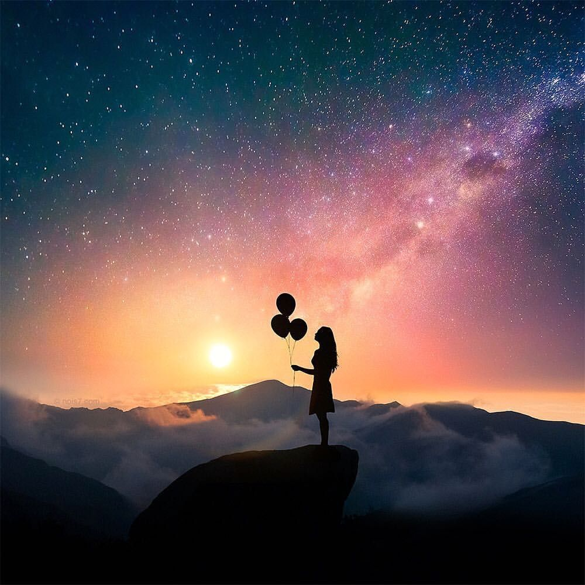

# Chapter 1: Intro

## 1.1. Task 1: Image rows, columns and channels
An image is a matrix in which every element is a pixel of the image. A pixel's value goes from 0 to 255, meaning that we need 1 byte (8 bits) to store it. For b/w images, that value (0-255) represents a shade of grey (the image is viewed as a 2D matrix). But for color images, the matrix is rather more-dimensional so we can represent the intensity of each basic color (Red, Green and Blue) to get the resulting color. So, the 3rd dimension represents the images channels (R, G and B).

To take an image apart we'll use the OpenCv library.

We'll import the following image:
<br/><br/>


The code below will take the image apart and inform us of how many rows, columns and channels it consists.
```python
import cv2

image = cv2.imread('../img/image.jpg')

rows, columns, channels = image.shape

print("Original Image: ")
print('No. of rows: ' + str(rows))
print('No. of columns: ' + str(columns))
print('No. of channels: ' + str(channels))
```
The code can also be found [here](code/code_01.py)!

The console output:
```console
Original Image:
No. of rows: 1000
No. of columns: 1000
No. of channels: 3
```

## 1.2. Task 2: Image enlargement

## 1.3. Task 3: Image channels

## 1.4. Task 4: Color space

## 1.5. Task 5: Editing pixels
